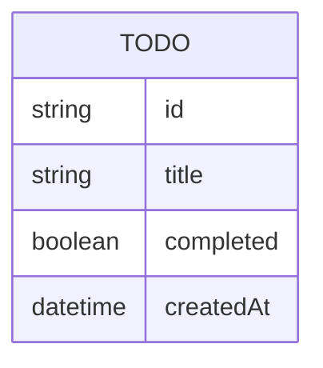

# Domain Model

The Todo app has a single entity: a Todo, held in the API service's in-memory
store. There is no persistence and no relation to any other entity — no
accounts, no ownership, no categories.

`id` is server-generated at creation. `createdAt` is set once, at creation,
and is what the list order (oldest first) is derived from.